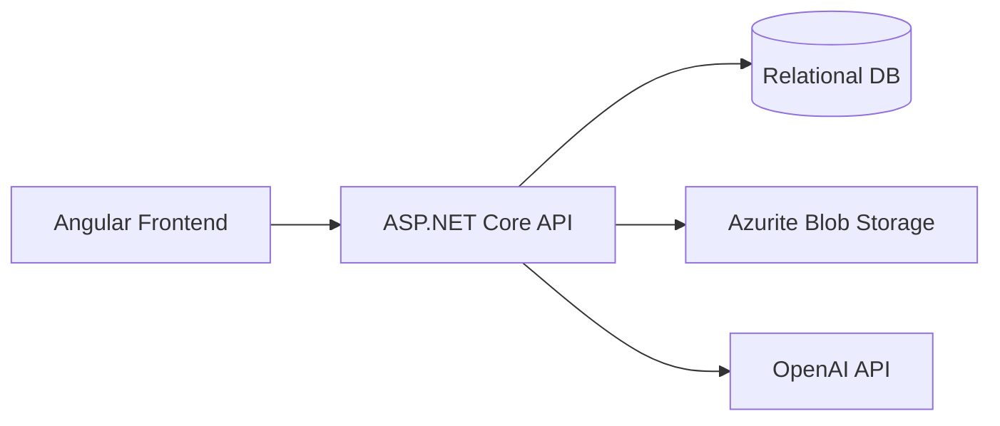

# Cognify: AI‑Powered Adaptive Learning Platform – Project Specification

Cognify is an **AI-driven adaptive learning system** that models learner cognition and dynamically adjusts teaching strategy.  
It demonstrates advanced AI integration, cognitive state modeling, and a closed-loop educational feedback system within a modern distributed architecture.

---

## 1. Project Overview

Cognify is a **containerized, AI-assisted learning platform** built for advanced AI system design, education, and rapid prototyping. It combines cognitive modeling, adaptive content generation, and analytics into a persistent learning intelligence system.

### Core Identity
> “An AI-powered adaptive learning system that models the learner’s cognition and dynamically adjusts teaching strategy.”

### Primary Goals

- **Cognitive Modeling** – Track mastery, confidence, mistake patterns, and memory decay.
- **Adaptive Content Generation** – Tailor quizzes and learning materials to knowledge state.
- **Continuous Learning Loop** – User → Data → AI Analysis → Model Update → Adaptive Content.
- **Mistake Intelligence** – Detect recurring conceptual errors.
- **Distributed Architecture** – Demonstrate complex state management with .NET Aspire.

---

## 2. Solution Structure & Components

```
Cognify.slnx
PROJECT_SPEC.md
Cognify.AppHost/
Cognify.Server/
cognify.client/
Cognify.ServiceDefaults/
```

### Components

| Component | Responsibility |
|----------|----------------|
| **AppHost** | Service orchestration via .NET Aspire |
| **Server** | ASP.NET Core API, AI integration, EF Core, JWT |
| **Client** | Angular 19 frontend UI |
| **ServiceDefaults** | Shared .NET extensions, service discovery, telemetry |

---

## 3. Technology Stack

### Backend
- ASP.NET Core 10
- Entity Framework Core
- JWT Authentication
- OpenAI API
- Azure Blob Storage SDK
- OpenTelemetry
- UglyToad.PdfPig

### Frontend
- Angular 19
- Angular Material
- RxJS

### Infrastructure
- .NET Aspire
- Docker
- Azurite
- OpenAI API

---

## 4. System Architecture



---

## 5. AI System & Learning Intelligence

### AI Agents

| Agent | Role |
|------|------|
| OCR Agent | Extract text & images from documents |
| Question Generation Agent | Create adaptive quizzes + rubrics |
| Quiz Repair Agent | Fix Markdown/LaTeX issues |
| Grading Agent | Rubric grading + mistake detection |
| Learning Analytics Agent | Update mastery, decay, performance metrics |

---

## 6. End‑to‑End Pipelines

### A2 — Document Upload → Extraction

1. Store file in Blob
2. Create Material DB record
3. Extract text + images
4. Create Markdown draft note
5. User review → save
6. Update material status

### B — Generate Adaptive Quiz

1. Load notes + knowledge state
2. Call Question Generation Agent
3. Persist quiz + rubric
4. Return adaptive quiz

### C — Submit Answer → Grade

1. Save interaction
2. Call Grading Agent
3. Persist evaluation + mistakes
4. Update knowledge model

---

## 7. Domain Model

Key tables:

- Material
- MaterialExtraction
- Note
- Quiz / QuizQuestion / QuizRubricItem
- LearningInteraction
- AnswerEvaluation
- UserKnowledgeState

---

## 8. Implementation Rules

- Thin Controllers → Service Layer
- Strict DTO boundaries
- Agent idempotency
- Agent run logging
- Graceful error handling
- Contract-based testing

---

## 9. Supported Document Formats

### With Embedded Images
PDF, DOCX, PPTX, XLSX, HTML, EPUB

### Image‑only (OCR)
PNG, JPG, WEBP, BMP, TIFF

### Text‑only
TXT, MD, JSON, YAML

---

## 10. Security

- JWT authentication
- Owner-only data access

---

*Updated 2026 – Combined Product + System Specification*
