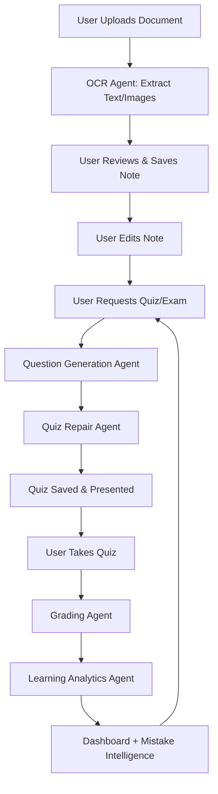

# 🧠 Cognify: Personalized Cognitive Tutor Platform

> **An AI-powered adaptive learning system that models the learner’s cognition and dynamically adjusts teaching strategy.**

Cognify goes beyond simple quizzes to build a persistent **User Knowledge Model**, predicting memory decay and adapting content to each learner’s style, performance patterns, and conceptual gaps.  
It operates as a **closed-loop AI learning system**, where every interaction refines the model and influences future content.

---

## 🚀 Core Learning Intelligence

### 🧠 User Knowledge Model
Persistent tracking of cognitive state per topic:

- **Mastery Score** – Concept understanding level  
- **Confidence Score** – Self-reported certainty  
- **Mistake Patterns** – AI-detected recurring conceptual errors  

This model evolves continuously, forming the foundation for all adaptive decisions.

---

### 🔁 Continuous AI Feedback Loop

> **User Action → Data Capture → AI Analysis → Knowledge Model Update → Adaptive Content**

Unlike stateless AI systems, Cognify maintains a persistent cognitive state, enabling long-term personalization and memory modeling.

---

### 🎯 Adaptive Quiz Engine

AI generates diverse assessment types tailored to knowledge state:

- Multiple Choice & True/False  
- Open-Ended Questions (AI-graded)  
- Matching / Pairing  
- Context-aware questions based on user documents  
- Adaptive difficulty scaling (Recall → Application)

---

### 📉 Learning Decay Prediction

Cognify predicts when knowledge is likely to decay and schedules reviews automatically, implementing AI-driven **Spaced Repetition**.

---

### 📊 AI Learning Dashboard

Visualizes cognitive state:

- Knowledge heatmap  
- Decay forecast  
- Weakness detection  
- Performance trends  
- Learning velocity metrics  
- Exam Readiness Score

---

### ❌ Mistake Intelligence

AI builds a personalized misconception profile, classifying recurring conceptual errors and driving targeted remediation.

---

## 🤖 AI System Architecture

Cognify is powered by specialized AI agents forming a structured pipeline.

### AI Agents

| Agent | Role |
|------|------|
| **OCR Agent** | Extracts text from PDFs, Office docs, HTML, and e-books → outputs Markdown + LaTeX + image metadata |
| **Question Generation Agent** | Generates adaptive quizzes and structured grading rubrics |
| **Quiz Repair Agent** | Fixes malformed Markdown/LaTeX and formatting inconsistencies |
| **Grading Agent** | Rubric-based grading + conceptual mistake detection + feedback |
| **Learning Analytics Agent** | Updates mastery estimates, decay prediction, and performance analytics |

---

## 🗺️ AI Learning Flow

---

## 💡 Learning-Focused User Flows

1. Upload document → AI extracts text/images → Save as note  
2. Edit notes with Markdown + LaTeX + embedded images  
3. Generate adaptive quiz/exam from notes  
4. AI repair ensures clean formatting  
5. Take quiz → AI grading + feedback  
6. Analytics update knowledge state  

---

## 💻 Tech Stack

- **Backend:** ASP.NET Core 10  
- **Frontend:** Angular 19  
- **AI:** Azure OpenAI  
- **Orchestration:** .NET Aspire  
- **Data:** SQL Server + Azure Blob Storage  

---

## 🏃 Getting Started

1. Clone the repository  
2. `dotnet dev-certs https --trust`  
3. `cd Cognify.AppHost`  
4. `dotnet run`
